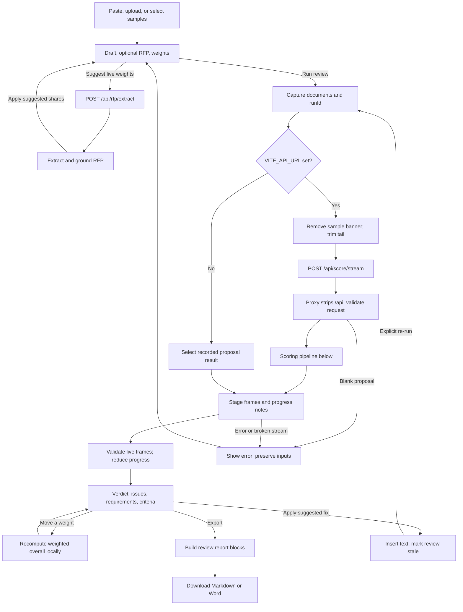
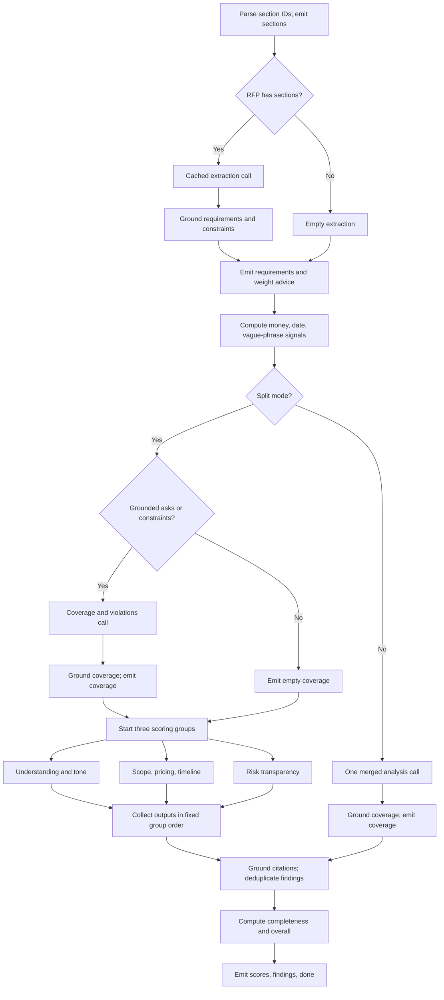
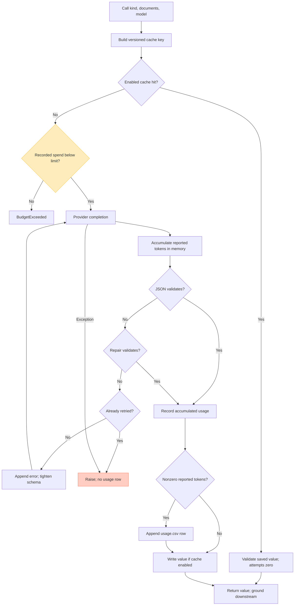

# Proposal Scorer: main flow, verification, and usage audit

Reviewed on **18 September 2026**. Source snapshot: commit `6dd8d953c30ffcbd195fc54549ec2eef95eb82b4`, captured at 04:50:22 UTC. Final ledger snapshot: **04:54:08 UTC / 06:54:08 Europe/Berlin**, including five subsequently appended local rows. Live runs continued during the audit; totals below are explicitly for this capture time.

**The main pipeline works on the recorded examples, but the usage ledger is an incomplete estimate of paid model consumption.** Its 45 rows are arithmetically correct and total **USD 0.257103**. Twenty rows match the committed provider recordings exactly. Failed structured-output calls can consume tokens without reaching the ledger, and the budget check does not impose a strict spending cap.

The local `app/.env` also has **`USE_CACHE=false`**. When the backend loads that file, repeated reviews call the provider again. The documentation's claim that repeated sample reviews are free depends on enabling and populating the disk cache.

This report contains the diagrams, implementation references, executed checks, limitations, and recommended corrections. Source code, fixtures, and the real ledger were not modified by this audit. Offline probes used temporary ledgers and fake or replay providers; the audit made no paid model calls.

## Scope and evidence

The scan covered the Python API and pipeline, provider adapters, schemas, prompts, grounding, aggregation, replay/recording, backend tests, React application state, API client and streaming adapter, review controls, evidence display and export, deployment configuration, sample documents, recorded responses, runtime cache, and usage ledger. UI primitives and visual assets were inventoried; this was not a visual or accessibility audit.

The repository changed while the review was running. An initial test encountered an in-progress change to streaming events. The final snapshot includes the completed progress/logging changes, the subsequent usage update, and the evidence/export feature; the final full check passes. Findings below refer to that final snapshot, not the intermediate failure.

Evidence labels used below:

| Label | Meaning |
|---|---|
| **Executed** | Exercised with existing tests, saved responses, or an isolated offline probe. |
| **Source** | Followed through implementation/configuration; not tested against the deployed service. |
| **Gap** | An executed probe demonstrates behavior inconsistent with the intended guarantee. |
| **Unverified externally** | Requires provider billing records, a real deployment, or new live model output. |

Local configuration was read through an allowlist of non-secret settings. A running process can have different environment values: configuration is loaded at Python import time, and Vite's API URL is fixed at build time.

## Main user flow

The diagrams are embedded Mermaid and render in compatible Markdown viewers. The detailed tables below provide the same flow without requiring a diagram renderer.



The optional suggestion request shares the extraction cache with a review **only when `USE_CACHE=true`**. It saves the extraction call; the remaining scoring calls still run on a cache miss. In browser mock mode, weight advice comes from the known RFP's recording instead of this endpoint, and the recorded result is validated before frames are synthesized. Moving a slider does not create another run. Applying a fix changes local draft text and requires an explicit re-run to refresh findings and scores. Export builds a local file without an API request.

| Step | Implementation and actual behavior | Verification |
|---|---|---|
| Input | [`WitnessInput`](../frontend/src/features/review/witness-input.tsx#L71) reads `.md`, `.markdown`, or `.txt` as text. Samples come from bundled Markdown. RFP is optional; draft is required. | **Source**; sample-copy parity is checked by `test_frontend_sample_copies_match_sample_data`. No new browser upload interaction was performed. |
| Canonical text | [`canonical`](../frontend/src/lib/quote.ts#L108) removes lines beginning with `**Variant:` and trims trailing whitespace. [`requestFor`](../frontend/src/api/client.ts#L33) canonicalizes both documents. | **Executed** fixture parity and replay checks; this is different from the looser normalization used to match quotations. Direct API callers must canonicalize their own text if they want identical replay/cache keys. |
| Start/cancel | [`App.startRun`](../frontend/src/App.tsx#L117) captures documents, criteria, and `Date.now()` as run ID. [`useReview`](../frontend/src/api/use-review.ts#L24) uses a streamed TanStack query with retry disabled; cancel propagates an abort signal. | **Source**. Provider-side cancellation and whether already-started calls remain billable were not exercised. |
| Suggest weights | [`suggestWeights`](../frontend/src/api/client.ts#L53) calls `/rfp/extract`; [`App`](../frontend/src/App.tsx#L56) applies the suggestions and rebalances to integer shares totaling 100. | **Executed** endpoint and shared-cache tests. The suggestions are applied immediately on success, then the user can adjust them. |
| Transport | [`streamScore`](../frontend/src/api/stream.ts#L33) uses POST `fetch`, UTF-8 decoding, `eventsource-parser`, and generated Zod validation. A byte-level 60-second idle watchdog counts ping comments as activity. | **Executed** 15 actual backend frames through the frontend parser in 37-byte chunks; malformed JSON/schema, error frame, early EOF, HTTP 400, and HTTP 502 handling checked. The real 60-second timeout was not waited out. |
| Progress | [`reduceProgress`](../frontend/src/api/progress.ts#L56) stores stage payloads and the last 20 progress notes; `done` builds the review via `adapt`. | **Executed**: medium response ends at `done`, overall 2.29, 10 requirements, 8 UI issues, 9 progress notes. |
| Presentation | [`adapt`](../frontend/src/api/adapt.ts#L91) joins requirements/coverage/constraints, maps violations and findings into UI issues, resolves section labels, and groups deterministic evidence under criteria. | **Executed** reducer/adapter path and new evidence mapping: all 4 medium-sample signals retained, 3 under pricing and 1 under timeline. Browser layout, scrolling, and quotation highlighting were not visually rechecked. |
| Reweight | [`weightedScore` / `overallOf`](../frontend/src/lib/score.ts#L86) recompute from existing criterion scores; [`App`](../frontend/src/App.tsx#L113) derives score during rendering. | **Source + executed arithmetic**. Changing criteria does not change the captured run/query key. |
| Apply/revert | [`applyFix`](../frontend/src/App.tsx#L95) inserts a paragraph after the matching quotation, or appends it when no match is found. Revert removes the first exact inserted block. | **Source + targeted quote probe**. Normalization differences can put a fix at the end instead of beside its quote; see F7. |
| Export | [`ReviewView.exportAs`](../frontend/src/features/review/review-view.tsx#L400) builds shared report blocks, serializes Markdown or Word, then triggers a browser download. | **Executed** report-model and Markdown serialization probes. Word packaging and browser download were inspected in source, without a Word layout/render check. Exported verdict and incomplete-review wording have gaps, F9. |

## Backend scoring flow



Every model node uses the cache/provider procedure in the next diagram. Progress notes are interleaved around these stages; group notes arrive in completion order, but score/finding merging uses the fixed group order. [`pipeline.run`](../app/src/app/pipeline.py#L235) is the orchestrator; `/score` consumes the same generator and returns its final result.

| Stage | Inputs → outputs and rules | Evidence |
|---|---|---|
| Request validation | `ScoreRequest` contains `proposal`, optional `rfp`, optional relative weights. Blank draft → HTTP 400 before streaming; malformed types → FastAPI validation response. | [`main.py`](../app/src/app/main.py#L54), [`schema.py`](../app/src/app/schema.py#L227); **Executed** route tests and a blank real ASGI request. Negative weights remain a gap, F6. |
| Parsing | Markdown heading tree → `§0`, `§1`, `§1.1`, etc. Bold/all-caps pseudo-headings are fallback boundaries; plain paragraphs become `¶1`, `¶2`. Outlines and section markers are reused in prompts and citations. | [`splitter.parse`](../app/src/app/splitter.py#L173); **Executed** all section-parser tests, including fallback, hierarchy, lookup, and rendering. |
| Extraction | RFP text → requirements, hard constraints, suggested relative weights. Quotes are grounded before downstream calls. No RFP skips this call. | [`extract_rfp`](../app/src/app/pipeline.py#L187), [`ground_extraction`](../app/src/app/grounding.py#L107); **Executed** pipeline, grounding, extraction endpoint, and replay tests. |
| Signals | Proposal section bodies → vague phrases, money mentions, date/duration mentions; section headings identify pricing/timeline context. Mentions outside those sections are retained separately in the prompt summary. | [`signals.py`](../app/src/app/signals.py#L108); **Executed** weak/strong/overpromise signal tests. These are lexical evidence, not proof that a price or schedule is feasible. |
| Coverage/violations | Grounded requirements/constraints + marked proposal → requirement status and explicit constraint violations. Unknown IDs are removed; `MISSING` loses any proposal quote/location. | [`build_coverage_prompt`](../app/src/app/prompts.py#L214), [`ground_coverage`](../app/src/app/grounding.py#L125); **Executed** pipeline/grounding tests. Unquoted contradiction and completeness-of-output gaps remain, F3/F4. |
| Parallel scoring | Understanding scores problem understanding and tone; commercials scores scope, pricing, timeline; risk scores risk transparency. All see extracted asks and grounded coverage/violations. Understanding also gets the full RFP; commercials gets regex signals. | [`GROUPS`](../app/src/app/prompts.py#L82), [`build_group_prompt`](../app/src/app/prompts.py#L239), [`pipeline.py`](../app/src/app/pipeline.py#L426); **Executed** split-mode tests and replay. Groups begin after coverage, not simultaneously with it. |
| Merged scoring | Extraction first, then one call returning coverage → violations → findings → six model scores. This prompt gets extracted RFP information, rather than the full RFP text used by split understanding. | [`build_score_prompt`](../app/src/app/prompts.py#L303); **Executed** fake-provider merged-mode and prompt tests. No live Ollama run was performed. |
| Grounding | Case/Markdown/typographic normalization, then exact section match. Relocated or near quotes are `fuzzy`; fuzzy threshold 90 with a 10-character minimum. Unverified quotations are dropped by default. Quote-less score citations can be verified solely by a valid section ID. | [`verify`](../app/src/app/grounding.py#L73), [`ground_scores`](../app/src/app/grounding.py#L201); **Executed** grounding tests. This verifies provenance, not the truth of the model's interpretation or fix. |
| Findings | Ground finding quotations, correct locations, then deduplicate overlapping normalized quotes in the same section; higher severity wins. Results sort HIGH → MEDIUM → LOW. | [`ground_findings`](../app/src/app/grounding.py#L231), [`dedupe_findings`](../app/src/app/aggregate.py#L107); **Executed** grounding and aggregation tests. |
| Completeness | For each extracted requirement: ADDRESSED = 1 credit, PARTIAL = 0.5, MISSING/CONTRADICTED/no verdict = 0. Score = `round(1 + 4 × credit / requirement_count)`, clamped to 1–5, using Python rounding. No requirements → null. | [`completeness_from_coverage`](../app/src/app/aggregate.py#L46); **Executed** formula and no-RFP tests. No requirements after filtering is treated like no RFP even if input text was supplied. |
| Overall | `round(sum(score × weight) / sum(weight), 2)` over non-null scores. Missing weight defaults to 1; null criterion scores are excluded. All-zero effective weight → null. | [`weighted_overall`](../app/src/app/aggregate.py#L34); **Executed** aggregation tests. Score caps in `prompts.SCORE_RULES` are instructions to the model, not deterministic clamps. |
| Delivery | Stage frames: `sections → requirements → coverage → scores → findings → done`, with `progress` frames between them. Native SSE adds keep-alive pings. `done` carries scores, coverage, violations, findings, signals, outlines, warnings, and metadata. | [`main.stream`](../app/src/app/main.py#L94), [`schema.StreamEvent`](../app/src/app/schema.py#L379); **Executed** SSE route/ping tests, replay ASGI request, and generated frontend validation. |

The seven criterion IDs are `problem_understanding`, `scope_clarity`, `pricing_clarity`, `timeline_clarity`, `completeness`, `tone_persuasiveness`, and `risk_transparency`. Only completeness and the weighted overall are calculated deterministically. UI verdict thresholds are overall ≥ 4: **Ready to send**; ≥ 2.5: **Fix before sending**; otherwise **Not ready**. Null means **Not scored**.

### Expected model work

These are logical provider completions before validation retries and SDK transport retries. Successful network completions and CSV rows are not always one-to-one.

| Scenario | Extraction | Coverage | Scoring | Total before retries |
|---|---:|---:|---:|---:|
| Fresh RFP + draft, split | 1 | 1 | 3 groups | 5 |
| Same RFP, changed draft, extraction cached | 0 | 1 | 3 groups | 4 |
| No RFP, split | 0 | 0 | 3 groups | 3 |
| RFP supplied but no grounded requirements/constraints retained, split | 1 | 0 | 3 groups | 4 |
| Fresh RFP + draft, merged | 1 | Included in merged call | 1 | 2 |
| No RFP, merged | 0 | Included in merged call | 1 | 1 |
| All required disk-cache entries present, cache enabled | 0 | 0 | 0 | 0 |
| Weight slider changed on a completed review | 0 | 0 | 0 | 0 |
| Suggest weights on a fresh RFP | 1 | 0 | 0 | 1 |

`LLM_SPLIT_CALLS=auto` selects split mode for Gemini and replay, merged mode for Ollama. Explicit `true`/`false` overrides it. With local `USE_CACHE=false`, an unchanged split review still makes five logical completions; suggesting weights and then reviewing performs extraction twice.

### Failure behavior

| Trigger | Result | Verified by |
|---|---|---|
| Extraction fails | Blocking endpoint → 502; streaming endpoint → terminal `error`, no final review. | Route tests and `test_call_1_failure_raises`. |
| Coverage or merged analysis fails | Terminal `done` with `partial=true`, error text, extracted requirements/constraints, null overall and no scores; split groups do not run. | `test_coverage_call_failure_yields_partial_result_with_requirements`, replay failure test. |
| One scoring group fails | Other groups survive; failed group's criterion scores become null, warning added, `partial=true`. | `test_split_mode_group_failure_nulls_only_that_groups_criteria`. |
| Output is cut but repair validates | Repaired prefix is used; truncation warnings and partial state persist through the disk cache. | Truncation/salvage tests. |
| Syntactically valid but incomplete output | It can pass validation without setting partial; see F3. | **Gap**, empty-group probe. |
| Stream ends without `done` | Client raises an upstream error rather than accepting an unfinished review. | **Executed** frontend EOF probe. |

The stream error's `stage` currently names the last emitted event. With narrated events this may be `progress`, not the underlying phase such as `requirements`. This is visible in [`main.stream`](../app/src/app/main.py#L100); phase-specific error wording is therefore less precise than the trace itself.

## Cache, provider, retry, and accounting flow



The missing edge is consequential: there is no durable accounting write when validation ultimately raises. There is also no budget check or reservation around the strict retry, and the three scoring groups independently inspect the same previously recorded balance.

| Layer | Exact behavior | Verification |
|---|---|---|
| Disk cache | `data/cache/<sha16>.json`; hash of `kind`, `PROMPT_VERSION` (currently `4`), provider model, and raw document strings joined with `||`. Weights are excluded. Cached raw output is grounded again on read. | [`cached_call`](../app/src/app/pipeline.py#L121); cache/version/model/reweight tests pass. Generation settings, schema, full prompt hash, and upstream extraction/coverage output are not in this key; see F8. |
| Gemini | `google-genai`, JSON response schema, configured model/temperature, max 16,384 output tokens; medium thinking for extraction/coverage, low for groups under the inspected configuration. | [`GeminiProvider`](../app/src/app/llm.py#L228); SDK payload and token mapping tested using `httpx.MockTransport`. |
| SDK retry | Three total SDK attempts configured for HTTP 429/503, with backoff; this is separate from the one structured-output retry. | [`llm.RETRY`](../app/src/app/llm.py#L213); rate-limit test passes. `meta.llmCalls` does not count these internal HTTP attempts. |
| JSON retry | Parse, try `json_repair`, then one strict retry if unusable. Successful retry sums both attempts' token counts into one `CallStats`. | [`call_json`](../app/src/app/llm.py#L344); unit tests and two-attempt probe. |
| Replay | Prompt-text SHA-256 prefix selects a committed recording. Replay returns no token usage; misses raise rather than contacting the network. | [`ReplayProvider`](../app/src/app/replay.py#L45); replay tests and five sample reviews passed with no ledger created. |
| Recording | Existing recording → free replay; miss → real provider, save raw response and token metadata. | [`RecordingProvider`](../app/src/app/replay.py#L93); recorder test passes. Recording data supports local reconciliation but is not an independent bill. |
| Ollama | Local `/api/generate`, JSON schema, 16k context; adapter does not return token counts to `TokenUsage`. | [`OllamaProvider`](../app/src/app/llm.py#L173); request test passes. Its compute/token usage is absent from the CSV. |
| Ledger | Nonzero token totals append one row only after `call_json` returns successfully. USD is calculated locally. | [`usage.record`](../app/src/app/usage.py#L67); arithmetic, normal recording, and failure/retry probes below. |
| Budget | Checks all rows in the working-directory-relative ledger; blank budget means unlimited. Daily USD 20 threshold logs a warning, rather than stopping calls. | [`usage.check_budget`](../app/src/app/usage.py#L55); threshold tests pass, strict-cap probes fail the stronger guarantee. |

## Does `app/data/usage.csv` reflect real usage?

**Partly. It is a credible local record of token counts for successfully parsed provider calls, valued at a particular list price. It is neither a complete record of all attempts nor proof of the amount actually billed by Google.** It also does not measure application users, sessions, total reviews, or cache-hit rates.

### Snapshot and arithmetic

The audited file is [`app/data/usage.csv`](../app/data/usage.csv), now tracked in Git. Its SHA-256 is:

```text
4793200f7124ccf36a712046ff0c7d7c0d8bf53e7858a1acd91994207e5b6778
```

It contains one header and **45 data rows**, 3,398 bytes. All rows name `gemini-3.8-flash`. All token counts are nonnegative; there are no identical duplicate rows; every row's stored USD agrees with the formula within six-decimal rounding tolerance.

| Measure | Audited total |
|---|---:|
| Prompt tokens | 85,521 |
| Candidate output tokens | 26,371 |
| Thinking tokens | 25,085 |
| Provider-cached prompt tokens | 0 |
| Prompt + candidate + thinking tokens | 136,977 |
| Sum of stored, rounded USD rows | **0.257103** |
| Cost recomputed before per-row rounding | **0.25710075** |
| Accumulated rounding difference | 0.00000225 |
| Remaining against configured USD 5 threshold, using this ledger only | 4.742897 |

The implemented formula is:

```text
fresh_input = max(prompt - cached, 0)
estimated_USD = (fresh_input × 0.75 + cached × 0.075
                 + (output + thinking) × 3.75) / 1,000,000
```

Google's published standard paid-tier Gemini 3.8 Flash prices on the audit date match these rates through 31 December 2026. Output pricing includes thinking. The same page lists different rates from 1 January 2027 and a free tier; the ledger does not store the account tier or pricing effective date. [Google Gemini API pricing](https://ai.google.dev/gemini-api/docs/pricing#gemini-3.8-flash).

The SDK field mapping is also correct: prompt includes cached tokens; candidate output and thinking are separate counters. Subtracting cached tokens before charging fresh input avoids charging those tokens at both input rates. [Google UsageMetadata reference](https://ai.google.dev/api/generate-content#UsageMetadata).

The zero `cached` column means **no provider-reported cached prompt tokens**, not zero application cache hits. Application disk-cache hits never create CSV rows. The application does not configure paid context-cache storage or external grounding tools in these requests.

| Call kind | Rows | Prompt | Output | Thinking | Stored USD |
|---|---:|---:|---:|---:|---:|
| `extract` | 6 | 4,910 | 7,085 | 5,333 | 0.050250 |
| `coverage` | 9 | 16,546 | 6,543 | 19,752 | 0.111017 |
| `group:understanding` | 10 | 22,665 | 4,021 | 0 | 0.032077 |
| `group:commercials` | 10 | 22,359 | 6,578 | 0 | 0.041438 |
| `group:risk` | 10 | 19,041 | 2,144 | 0 | 0.022321 |
| **Total** | **45** | **85,521** | **26,371** | **25,085** | **0.257103** |

Thinking alone contributes USD 0.09406875 before rounding, about 36.6% of the calculated cost. It is already included in the CSV's USD column; adding it again would double-count it.

### Reconciliation with recordings and documentation

For every file in [`tests/fixtures/replay`](../app/tests/fixtures/replay), the tuple `(kind, model, prompt, output, thinking, cached)` was matched against the CSV. **All 20 recordings have exactly one matching ledger row**, collectively CSV lines 2–21. This is strong internal consistency evidence; both artifacts originate from the same application, so it is not independent provider confirmation.

| CSV lines, inclusive | Recorded timestamps | Rows | Stored USD | Attribution confidence |
|---|---|---:|---:|---|
| 2–21 | 18 Sep 01:24:33–01:25:24 | 20 | 0.095068 | Exact token/kind/model match to all 20 committed recordings. |
| 22–26 | 17 Sep 23:55:08–23:55:22 | 5 | 0.029491 | Matches the approximate rehearsal amount in `docs/budget.md`; exact document attribution is not encoded in the ledger. |
| 27–31 | 18 Sep 04:17:42–04:17:54 | 5 | 0.028111 | One extraction, one coverage, three groups; documents cannot be identified conclusively. |
| 32–36 | 18 Sep 04:21:00–04:21:24 | 5 | 0.053931 | Same five-call pattern; elevated thinking explains most of the higher cost. |
| 37–41 | 18 Sep 04:34:43–04:34:52 | 5 | 0.024857 | Same five-call pattern; included from the latest usage commit. |
| 42–46 | 18 Sep 04:53:01–04:53:12 | 5 | 0.025645 | Same five-call pattern; local rows appended during the audit, included in the final ledger capture. |

The initial recording count is consistent with four RFP sample reviews sharing one recorded extraction, plus one no-RFP review: `1 extraction + 4 coverage + 5 × 3 groups = 20` new provider responses. Replay/recording reuse explains why the count is not five calls for every recorded review.

[`docs/budget.md`](budget.md) still says USD **0.125** spent. The first 25 rows total **0.124559**, which rounds to that amount. Twenty subsequent rows add **0.132544**, making the captured total **0.257103**. The document is a historical snapshot and is now stale.

Raw date-prefix subtotals are 17 September: **USD 0.029491**; 18 September: **USD 0.227612**. The timestamps have no UTC offset, and line 22 goes backwards relative to line 21. The source uses naive `datetime.now()` and `date.today()`. Mixed host/container time zones or merged runs are plausible explanations, but the ledger cannot establish which occurred. These date buckets are not a verified provider billing-day reconciliation.

### What the file cannot establish

- Whether every chargeable response was recorded: terminal parse failures are demonstrably omitted, and usage metadata is discarded when Gemini returns no candidates before the adapter extracts usage.
- Exact network request count: a successful structured-output retry combines two completions into one row; SDK 429/503 retries are separate again.
- Exact review/document attribution: there is no run ID, attempt ID, document/prompt hash, provider response ID, or response model version in the CSV. The console's short run tag is not carried into the ledger.
- Account-level USD billed: tier, credits, discounts, other clients using the same key/project, and requests whose responses never reached the application cannot be reconciled from this repository.
- Total application activity: cache hits, browser mocks, replay hits, and Ollama calls do not produce rows. `meta.llmCalls` is also not a paid-call count; replay reviews report 5 or 3 while costing no new tokens.

Provider-side request/usage or billing exports would be required to close that external reconciliation. Nothing in the local artifacts proves that unrecorded paid attempts occurred alongside these particular 45 rows; the probes establish that the implementation permits omission.

## Confirmed gaps and recommended corrections

The probes below are offline reproductions, not additional charges. No fixes were applied as part of this report.

| ID | Priority | Reproduction and observed result | Cause and correction |
|---|---|---|---|
| **F1** | High | A fake provider returned two unusable answers, each reporting 1,000 prompt, 200 output, and 50 thinking tokens. `ValidationError` was raised; **2 completions, USD 0.003375 equivalent consumption, 0 CSV rows**. Separately, a failed commercials group made 6 provider attempts but reported `meta.llmCalls=4`; failed coverage made 3 but reported 1 and `scoreCached=true`. | [`cached_call`](../app/src/app/pipeline.py#L154) records and merges stats only after successful `call_json`. Record provider usage per attempt immediately after each response, independent of parsing; retain failure stats, distinguish HTTP attempts from logical calls, and avoid initializing cache-success metadata to a misleading true state. |
| **F2** | High | With budget USD 0.001, three synchronized calls each reporting USD 0.000750 all started and recorded **USD 0.002250**. A failed-then-successful strict retry recorded **USD 0.003375** against the same USD 0.001 threshold. An exhausted ledger also blocked a free replay extraction. | [`check_budget`](../app/src/app/usage.py#L55) checks previously recorded spend once per cache miss, with no reservation or retry check; it runs for replay too. Use an atomic reservation/reconciliation mechanism for chargeable attempts, check retries, and bypass the spending guard for known free providers/hits. Describe the existing guard as a threshold, not a guaranteed maximum bill. |
| **F3** | High | Three groups returned valid `{"findings":[],"scores":[]}`. The run finished with **`partial=false`, no warnings, only completeness scored, overall 4.0**. The frontend's normal threshold would label that number **Ready to send**. | [`GroupLlmOutput`](../app/src/app/schema.py#L186) accepts empty lists; [`ground_scores`](../app/src/app/grounding.py#L201) synthesizes null missing scores, but [`pipeline.run`](../app/src/app/pipeline.py#L523) marks partial only for exceptions/truncation. Enforce each group's expected criterion IDs and coverage completeness, and mark missing assessments partial before deriving a verdict. |
| **F4** | Medium | A `CONTRADICTED` coverage item with `proposalQuote=null` and an invented section survived grounding with both location and grounding null. | [`ground_coverage`](../app/src/app/grounding.py#L145) accepts every no-quote non-MISSING item; the schema does not enforce status-specific evidence. Validate PARTIAL/CONTRADICTED evidence requirements. Keep the distinction between quotation verification and semantic judgment explicit. |
| **F5** | Medium | Browser mock mode reviewed the medium sample with an empty RFP and with an unrelated “Build a bridge” RFP. Both returned **10 NordFrame requirements, 6 RFP sections, completeness 3**. | [`mockStream`](../frontend/src/api/client.ts#L122) chooses solely by proposal text and reuses the RFP-based fixture. Match the document pair; use the committed no-RFP fixture only for its supported proposal and reject unsupported pairs. Backend replay correctly produced no requirements and null completeness for no-RFP medium. |
| **F6** | Medium | `ScoreRequest` accepted weights `{pricing_clarity: -1, risk_transparency: 2}`. With criterion scores 1 and 5, both aggregation functions returned **9.0**, outside the 1–5 scale. | [`Weights`](../app/src/app/schema.py#L65) is an unconstrained float dictionary; the UI restricts sliders but the API does not. Validate finite, nonnegative request weights and define the all-zero case. |
| **F7** | Medium | The backend verified `Budget is €80,000-€120,000.` against source containing an en dash. Frontend `findQuote` returned null; applying its fix appended after the document's last section. | Backend [`normalize`](../app/src/app/normalize.py#L39) folds typographic punctuation; frontend [`normalize`](../frontend/src/lib/quote.ts#L21) does not. Share normalization semantics and source-offset mapping, or return located spans from the backend. Fuzzy matches also need an explicit UI location strategy. |
| **F8** | Medium | A cached call was repeated after changing temperature to 0.9; it returned a cache hit with no second provider invocation. | [`cached_call`](../app/src/app/pipeline.py#L133) excludes temperature, reasoning, output budget, schema, and full prompt/upstream-output identity. Include the effective generation configuration and prompt/schema fingerprint, or make cache invalidation an explicit operational step. Weights should remain excluded. |
| **F9** | Medium | Giving completeness 100% weight on medium changed the current score to **3.0 / Fix before sending**, but the exported heading remained **Not ready**. Exporting a coverage-failed result printed all **4 constraints as respected** and **No issues found**, alongside its partial-review warning. | [`reportBlocks`](../frontend/src/lib/export.ts#L58) uses the original `review.verdict` instead of the current score, and interprets absence of violations/issues as success even when analysis failed. Derive the verdict from the supplied score; export unassessed constraints/issues explicitly. Both serializers share these report blocks. |

F1 also means a repeatedly failing, token-consuming request can leave the stored balance unchanged. F2's cap is further weakened by that omission. Conversely, successful two-attempt retries correctly accumulate both token totals into one row; the issue is loss on terminal failure and loss of attempt-level attribution, not universal retry undercounting.

Two documentation details need correction alongside these findings: “every real call appends a row” should describe the success-only, aggregated behavior until F1 is fixed; and “only an unseen pair reaches the model” needs the `USE_CACHE=true` prerequisite. The 20-word quotation limit, per-group ownership, and score caps are mainly prompt instructions, not fully enforced output invariants.

## Verification results

Final repository command, executed after the concurrent changes settled:

```bash
UV_CACHE_DIR=/private/tmp/sivihack-audit-uv-cache UV_OFFLINE=1 make check
```

| Check | Result and limit |
|---|---|
| Backend pytest | **83 passed**, 2 dependency deprecation warnings. Covers parsing, grounding, signals, aggregation, providers, retry, replay, pipeline modes/failures/cache, routes/SSE, OpenAPI, usage, and fixtures. |
| Ruff lint and formatting | Passed; 30 files already formatted. |
| Basedpyright | 0 errors, 0 warnings, 0 notes. |
| Frontend oxlint | Exit 0; **9 existing Fast Refresh export warnings**. |
| Frontend TypeScript + Vite build | Passed. Vite warns about the main JS chunk: **1,201.84 kB minified / 352.96 kB gzip** after the export feature. |
| Generated API files | Regenerated with pinned `@hey-api/openapi-ts` 0.99.0 in a temporary copy; all three generated file hashes unchanged. |
| Real ASGI routes with replay provider | `/health` 200 with `{"ok":true}`; blank `/score/stream` 400; `/rfp/extract` 200; `/score/stream` 200 `text/event-stream`, 15 frames for medium. |
| Backend → frontend contract | All 15 frames validated with generated Zod; chunked decoding/reduction reached the expected medium review. Six frontend error cases produced the intended error codes. |
| Recorded sample regression | Weak < medium < strong; overpromise violation detected; strong has no violations. No paid calls and no temporary ledger created by replay. |
| Ledger reconciliation | All 45 row costs checked, no identical duplicate rows, all 20 recordings matched uniquely, raw-date and call-kind totals recomputed. |
| Runtime cache | All 26 JSON files validated: 2 extractions, 5 coverage responses, 15 group responses, and 4 complete regression results. File presence does not cause hits while `USE_CACHE=false`. |
| Additional edge probes | F1–F9 reproduced, including concurrent budget overshoot, missing-score false completeness, mock RFP mismatch, cross-language quote/weight behavior, and misleading export labels. |
| Deployed nginx/Docker stack | **Source only** this session. Compose routing, shared data mount, SSE buffering configuration, and frontend build API URL inspected; no deployment restarted. |
| New live model behavior / provider bill | **Unverified externally**. Existing recordings validate software execution, not fresh-model quality on arbitrary proposals or invoice completeness. |

The Word library is eagerly imported by [`export.ts`](../frontend/src/lib/export.ts#L1), which is imported by the review view. Loading that serializer only when Word export is selected is a concrete opportunity to reduce the initial JavaScript bundle; no runtime performance benchmark was performed.

Recorded results, using equal backend weights and cache disabled:

| Sample | Overall /5 | Addressed | Partial | Missing | Contradicted | Violations | Findings | `meta.llmCalls` |
|---|---:|---:|---:|---:|---:|---:|---:|---:|
| Weak | 1.14 | 0 | 6 | 4 | 0 | 0 | 2 | 5 |
| Medium | 2.29 | 4 | 4 | 2 | 0 | 0 | 2 | 5 |
| Strong | 4.57 | 10 | 0 | 0 | 0 | 0 | 0 | 5 |
| Overpromise | 1.86 | 3 | 2 | 4 | 1 | 1 | 3 | 5 |
| Medium without RFP | 2.50 | 0 | 0 | 0 | 0 | 0 | 2 | 3 |

All five finished with `partial=false`. The no-RFP run had zero requirements/constraints and null completeness. Each RFP run had 10 requirements and 4 constraints. Model-call metadata in this table counts replay invocations; it represents **zero new paid calls**. Frontend integer weight shares can differ slightly from equal backend weights.

### Reproduce the ledger checks without a model call

Run from the repository root. This reads the CSV and recordings only and makes no edits:

```bash
python3 - <<'PY'
import csv, hashlib, json
from collections import Counter
from decimal import Decimal
from pathlib import Path

p = Path('app/data/usage.csv')
rows = list(csv.DictReader(p.open()))
columns = ('prompt', 'output', 'thinking', 'cached')
exact_total = Decimal(0)
for line, r in enumerate(rows, 2):
    prompt, output, thinking, cached = (int(r[k]) for k in columns)
    assert min(prompt, output, thinking, cached) >= 0
    assert cached <= prompt
    cost = (Decimal(prompt - cached) * Decimal('.75')
            + Decimal(cached) * Decimal('.075')
            + Decimal(output + thinking) * Decimal('3.75')) / 1_000_000
    assert abs(cost - Decimal(r['usd'])) <= Decimal('.0000005'), line
    exact_total += cost

index = Counter((r['call'], r['model'], *(int(r[k]) for k in columns))
                for r in rows)
matched = 0
for f in Path('app/tests/fixtures/replay').glob('*.json'):
    rec = json.loads(f.read_text())
    key = (rec['kind'], rec['model'], *(rec['usage'][k] for k in columns))
    assert index[key] == 1, f.name
    matched += 1

print('SHA-256:', hashlib.sha256(p.read_bytes()).hexdigest())
print('Rows:', len(rows), 'Recordings matched:', matched)
print('Token totals:', {k: sum(int(r[k]) for r in rows) for k in columns})
print('Stored USD:', sum((Decimal(r['usd']) for r in rows), Decimal(0)))
print('Unrounded USD:', exact_total)
print('Identical duplicates:', len(rows) - len({tuple(r.values()) for r in rows}))
PY
```

## Deployment and persistence boundaries

[`docker-compose.yml`](../app/docker-compose.yml) exposes nginx on port 80. `/api/*` proxies to backend port 8000 with the prefix removed; other paths proxy to the built frontend on port 3000. [`nginx.conf`](../app/nginx/nginx.conf) disables API buffering/cache and allows long reads for streamed scoring. Local Vite development uses the same `/api` prefix and forwards it to localhost:8000.

The Compose bind mount `./data:/app/data` persists model cache and ledger files. Both Python paths are relative to the process working directory: starting the package from the repository root instead of `app/` selects a different `data` directory, and therefore a different cache/budget balance. The frontend keeps documents, edits, runs, and review results in browser memory/query state; local storage remembers layout/witness visibility preferences. There is no database of saved reviews, authenticated user ownership, or background job queue in the scanned implementation.

The recommended correction order is **account for every chargeable attempt and make budget handling explicit; reject misleading incomplete assessments; repair evidence/mock/weight handling; align quotation matching and cache identity; then update the usage documentation and reconcile against provider-side records**.
